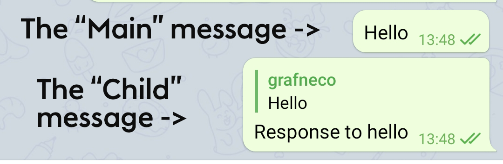

# Bug fixes report

**Source code:** [https://github.com/sfilmak/Telegram](https://github.com/sfilmak/Telegram)

### **Changes**

1. Partial fix of a bug with updating reply message: [https://bugs.telegram.org/c/179](https://bugs.telegram.org/c/179) (by "partial" I mean that only one part of this bug was fixed)
2. Fix of the dark themes bug based on the provided suggestion: [https://bugs.telegram.org/c/923](https://bugs.telegram.org/c/923)

**Note:** All code changes by me are marked with the comment `//sfilmak changes`

---

# Bug 179

### Bug fix description

My solution behaves in a following way: 

Nothing happens when someone edits the "Main" message (just like on a video attached to the description of this bug), but if a person would edit a message with a reply after editing the main message (let's call it a "Child" message), then reply header would be updated as well. I would attach a video showing this fix. I would send a link to the video in the comments, together with a list of changes.

The way to replicate:

Open any chat → Edit the "Main" message → Edit "Child" message with a reply to the "Main" message → See changes



---

### How it was fixed

1. I added a `messagesWithReplies` hash map to keep IDs of "Main" messages and a list of "Child" messages IDs:

```java
private HashMap<Integer, Set<Integer>> messagesWithReplies = new HashMap<>();
```

2.  Then, this map and set within it populated within `didReceiveNotification()` method, inside `NotificationCenter.messagesDidLoad` case:

```java
if (messagesWithReplies.containsKey(obj.replyMessageObject.getId())) {
     messagesWithReplies.get(obj.replyMessageObject.getId()).add(obj.getId());
} else {
     messagesWithReplies.put(obj.replyMessageObject.getId(), 
				new LinkedHashSet<>(Collections.singletonList(obj.getId())));
}
```

3. Finally, all "Child" messages are updated when the "Main" message was modified inside `replaceMessageObjects()` method:

```java
if (messagesWithReplies.containsKey(messageObject.getId())) {
    for (int i = 0; i < messagesWithReplies.get(messageObject.getId()).size(); i++) {
        List<Integer> valuesList = 
						new ArrayList<>(messagesWithReplies.get(messageObject.getId()));
        Integer toBeEditedIndex = valuesList.get(i);
        MessageObject editingReplyObject = messagesDict[loadIndex].get(toBeEditedIndex);

        editingReplyObject.replyMessageObject = messageObject;
		}
}
```

So, as I may assume, based on my fix, the problem is not with updating the views itself - the problem lies down in dictionaries with messages, which are not modified in this specific case.

However, why it doesn't work for a "normal case" (when we are editing just the "Main" message and see an updated version in "Child" messages) - I don't know, because I didn't figure out this part due to lack of time. 

---

### My way to a complete solution

Unfortunately, I did not have enough time to fix it completely. It almost works even when editing the main message, but it has 3 big problems:

1) **It is not updated "for the first time".** Way to replicate:

Open messages → Edit the "Main" message→ Edit the "Child" message → Edit "Main" message again → Header in a "Child" message with a reply to the "Main" message would be updated

2) **Wrong state of the message.** It would always "freeze" in a sending state, but the message itself would be updated on a server successfully (just enough to check it in a desktop client, for example).

3) **Bad replacement of a text.** Replicate this way:

Open conversation in this Android client → Open the same conversation in a different client (for example, Desktop) → Edit "Main" message on desktop →  Edit "Child" message on a desktop → Edit "Main" message again on desktop → See that "Child" message reverted to the previous message again

Everything described in this section should be considered an unfinished part, so I included it separately on a different branch: [https://github.com/sfilmak/Telegram/tree/part-of-the-fix](https://github.com/sfilmak/Telegram/tree/part-of-the-fix)

The final APK does not contain this code, because it is simply unfinished. I left this code to present my way of thinking on fixing this bug.

---

# Bug 923

I tried to fix this bug according to the proposed solution by Quirky Raven, who published this bug report on bugs.telegram.org

### How it was fixed

His/her idea was to use color lightness value from HSL. Instead, I found a handy method on the StackOverflow. This method does not require a color value to be converted into HSL and uses a simple formula:

```java
public static boolean isBrightColor(int color) {
        if (android.R.color.transparent == color)
            return true;

        int redColor = Color.red(color);
        int greenColor = Color.green(color);
        int blueColor = Color.blue(color);

        int brightness = (int) Math.sqrt(redColor * redColor * .299
                + greenColor * greenColor * .587
                + blueColor * blueColor * .114);

        return brightness >= 200;
}
```

Link: [https://stackoverflow.com/questions/16312792/how-to-check-color-brightness-in-android](https://stackoverflow.com/questions/16312792/how-to-check-color-brightness-in-android)

My method contains formula from this answer: [https://stackoverflow.com/questions/596216/formula-to-determine-brightness-of-rgb-color](https://stackoverflow.com/questions/596216/formula-to-determine-brightness-of-rgb-color)

And the modified `isDark()` method inside `Theme.java` class looks like this:

```java
public boolean isDark() {
    //sfilmak changes
    if(currentColors.containsKey(key_windowBackgroundWhite)){
         return !isBrightColor(currentColors.get(key_windowBackgroundWhite));
    }

    return name.toLowerCase().contains("night") 
					 || name.toLowerCase().contains("dark");
}
```

I also changed the way the name of the theme is being checked - now it looks if the theme contains "night" or "dark" words in its name.

### Suggestions

As it was said in an original bug report, it would be nice to implement a checkbox that would clearly show if the theme belongs to dark themes or not. Also, it would be great to make a separate selector for dark themes, because right now it is confusing for a user whether he/she selects a dark theme or not (they all listed in a single list).

# Conclusion

I spent most of the time during my work figuring out how the Telegram client works by reading the code, debugging the app (using breakpoints, of course), and even breaking the code so that I would understand what is responsible for what more clearly. Even taking into account the very sad fact that I was not able to fully fix the first bug, I am still happy that I tried and got into the source code of the app I am using every single day of my life for the last 5 years. I hope that I would get useful feedback on my "partially fixed bug" - it would be incredibly helpful for me. Thank you!